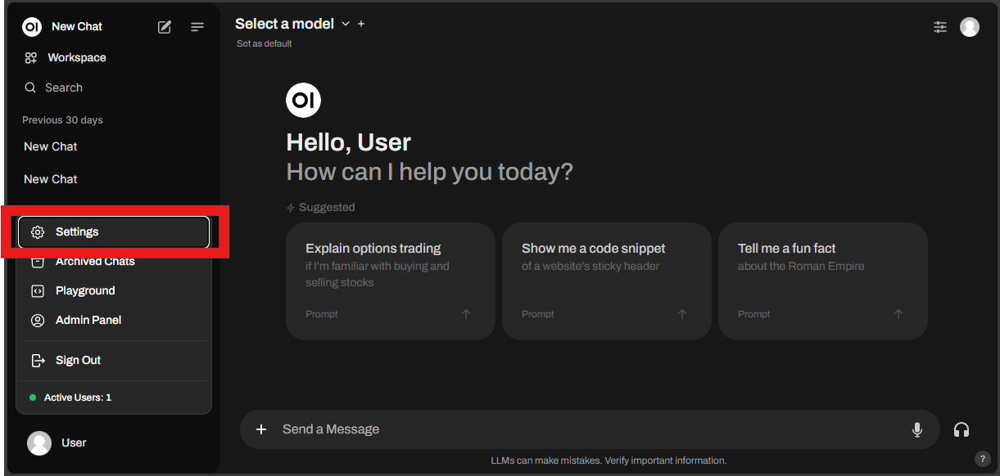
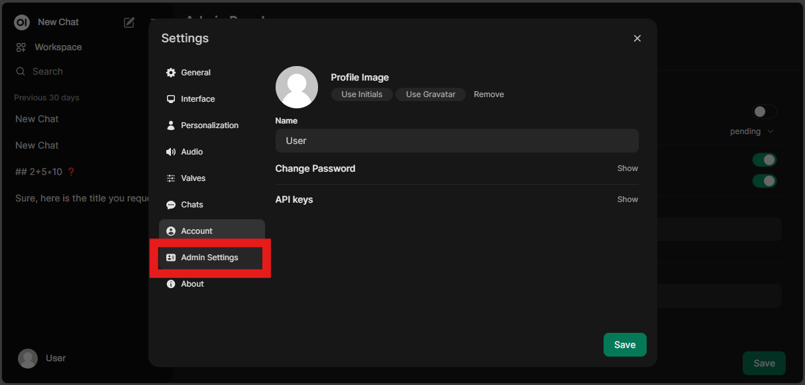
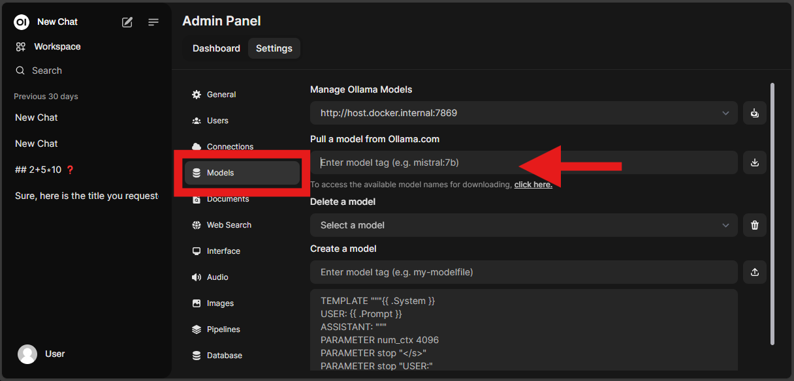
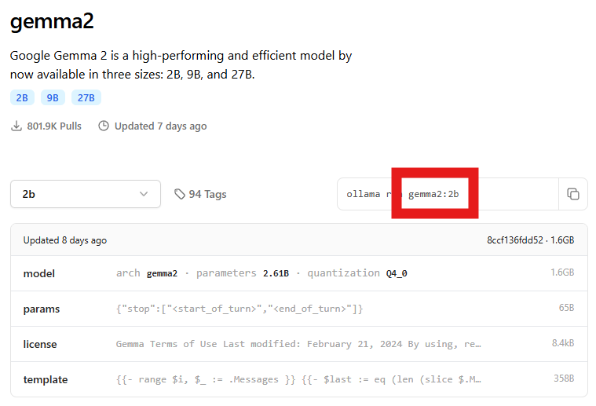
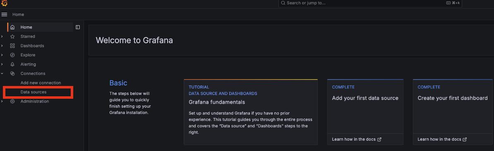
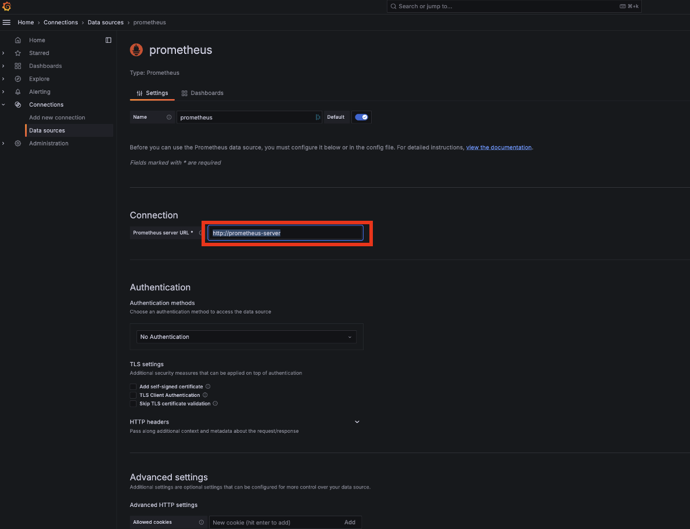
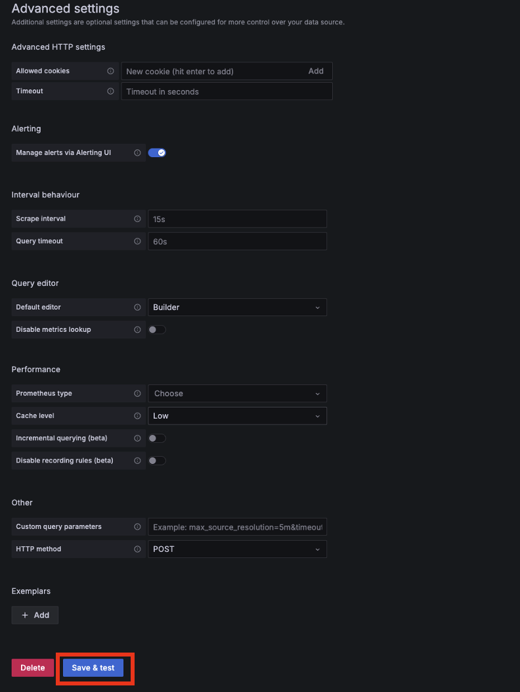
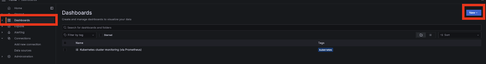
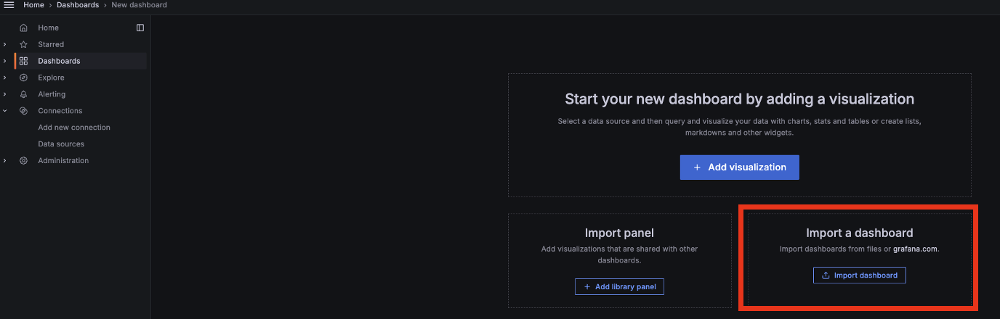
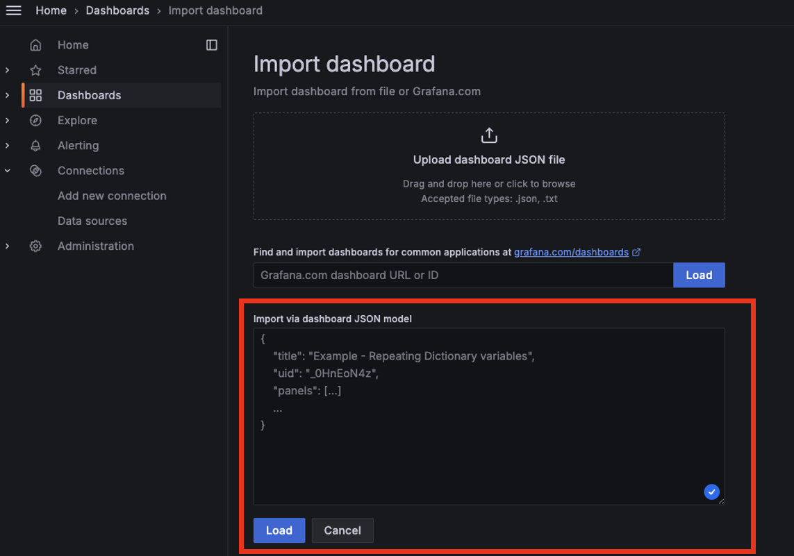

# Laborarbeit - Self-hosted LLM Chatbot

## Autoren

- Simon Hoch (CAS-TMINF23-S, 6349017)
- Jonas Dietsche (CAS-WMWI23-W, 3940917)
- Nadine Abu El Komboz (CAS-TMINF24-W, 5618268)

## Zielsetzung der Anwendung

Die Zielsetzung dieser Anwendung ist es, ein selbst gehostetes LLM (Large Language
Model) Chatbot-System bereitzustellen, das auf dem eigenen Rechner betrieben wird.
Das Hosting auf der eigenen Hardware gewährleistet hohe Datensicherheit und Kontrolle
über die sensiblen Informationen. Die Anwendung nutzt eine Microservices-Architektur
auf Kubernetes, um Anfragen effizient zu verarbeiten, dynamisch zu skalieren und das
System zu überwachen. Sie kann mehrere Instanzen eines Open-Source-LLMs ausführen
und die Skalierung basierend auf der Last automatisch anpassen. Zusätzlich besteht die
Möglichkeit, bei Bedarf über APIs auf LLMs von OpenAI zuzugreifen, was jedoch mit
einem potenziell geringeren Maß an Datensicherheit verbunden ist.

## Architektur


## Entwurf

Dieses Projekt basiert auf **OpenWebUI** und einer Docker-Implementierung von **Ollama**. Es wurde angepasst, um in einer Kubernetes-Umgebung als persistente Anwendung mit Load-Balancing betrieben zu werden. Die Lösung ist für lokale Deployments auf Endnutzergeräten ausgelegt und unterstützt aktuell nur eine **Single-User-Funktionalität**. Sie läuft auf einem einzelnen **Minikube-Node**, nutzt aber mehrere Pods für die Ausführung.

## Features

### Persistenz

- **Persistente Datenspeicherung** für die LLMs (Large Language Models) und **Chatverläufe** sowie auch für die **Dashboards** von Grafana
- Ein Ordner wird lokal automatisch erstellt, um die Integrität der Daten sicherzustellen, auch im Falle eines Node-Ausfalls.
- Dies garantiert, dass keine Daten verloren gehen und die Anwendung konsistent bleibt.
- Eine persistente Datenspeicherung der Prometheus Daten ist noch nicht implementiert, ist allerdings für zukünftige Releases in der Pipeline.

### Load Balancing

- Kubernetes übernimmt das **automatische Load-Balancing** der Pods.
- Zur Unterstützung der WebUI und der Weiterleitung von Anfragen zum Host ist ein **NGINX-Ingress-Controller** als externer Load Balancer erforderlich.

### Automatische Skalierung & Monitoring

- Die Anwendung unterstützt nun eine **automatische Skalierung** mithilfe eines **Horizontal Pod Autoscalers (HPA)**.
- Die HPA-Konfiguration basiert auf der **CPU-Auslastung** der Pods und passt die Anzahl der Ollama-Pods dynamisch an.
- Skalierung erfolgt zwischen **2** und **10 Pods**, um sowohl Redundanz als auch optimale Ressourcennutzung sicherzustellen.
- Beim Hochskalieren reagiert der HPA sofort, indem er bei Bedarf die Anzahl der Pods um **bis zu 100%** erhöht, während er beim Herunterskalieren vorsichtiger agiert, indem er maximal **50%** der Pods pro Schritt entfernt und dabei eine **60-sekündige Stabilisationsperiode** einhält.
- Für zukünftige Releases ist eine Optimierung der Grafana/Prometheus Implementierung geplant, da hierbei eine deutliche Zeitverzögerung von tatsächlicher Auslastung vs. Darstellung in den Dashboards besteht.
- **Prometheus**-Integration erlaubt das Monitoring und kann für dynamische Skalierung konfiguriert werden. Über **Grafana** werden die Daten in Dashboards visualisiert.

### Single-User-Support

- Derzeit wird nur **Single-User-Funktionalität** unterstützt, da eine Multi-User-Lösung (mehrere WebUI-Instanzen) noch nicht implementiert wurde.
- Diese Funktionalität ist für zukünftige Releases geplant.

### Geschwindigkeit

- Da die Anwendung ohne **GPU-Support** betrieben wird, ist die **Ausführungszeit langsamer** im Vergleich zu GPU-basierten Systemen.

# Installation

## Minikube starten

Um das Projekt lokal auszuführen, soll **Minikube** gestartet und der Projektpfad gemountet werden:

```bash
minikube start --mount-string="<Projekt_Pfad>\ollama:/c/SBX/cloud/Projekt/ollama" --mount
```

## Installation von Prometheus und Grafana

### Helm-Repositories hinzufügen

```bash
helm repo add prometheus-community https://prometheus-community.github.io/helm-charts
helm repo add grafana https://grafana.github.io/helm-charts
```

### Helm-Repositories aktualisieren

Um die neuesten Charts zu erhalten, sollten die Helm-Repositories aktualisiert werden:

```bash
helm repo update
```

## Metrics Server aktivieren

Der Metrics Server in Minikube kann mit folgendem Befehl aktiviert werden:

```bash
minikube addons enable metrics-server
```

## Ollama und Open-WebUI starten

```bash
kubectl apply -k ./kubernetes
```

## Grafana mit persistentem Volume installieren

Grafana kann mit einem persistenten Volume installiert werden:

```bash
helm install grafana grafana/grafana \
 --set persistence.enabled=true \
 --set persistence.existingClaim="grafana-pvc" \
 --set adminPassword=admin
```

## Prometheus installieren

```bash
helm install prometheus prometheus-community/prometheus
```

### Alternative Installation

Alternativ kann Grafana auch ohne persistent Volume installiert werden:

```bash
helm install grafana --set adminPassword=admin grafana/grafana
```

### Weitere Anleitungen:

Für weitere Informationen und Anleitungen können die Vorlesungsnotizen konsultiert werden:
https://farberg.de/talks/cloud/?03d%20-%20Monitoring%20and%20Scalability.md#/5

## Port Forwarding

Die folgenden Befehle sollten in separaten Terminalfenstern ausgeführt werden, um den Zugriff auf die verschiedenen Dienste zu ermöglichen:

```bash
kubectl port-forward svc/prometheus-server 8888:80
kubectl port-forward svc/grafana 9999:80
kubectl port-forward svc/webui-service 7777:8080
```

# Zugriff auf die Services

### Prometheus

http://localhost:8888

### Grafana

http://localhost:9999

Login:
username: admin
password: admin

### Open Webui

http://localhost:7777

Hierbei registrieren und anmelden.

## Installation eine Models

Dieses Projekt beinhaltet keine installierten Modelle. Deshalb müssen diese initial manuell installiert werden. Die Modelle werden persistent unter dem Pfad ./ollama/ollama gespeichert, sodass sie nur ein Mal installiert werden müssen.

Dazu muss wie folgt navigiert werden:  
Settings -> Admin Setting -> Models

Dort muss wie in den Bildern beschrieben ein Model Ollama.com herausgesucht werden.






# Einrichtung vom Monitoring

### Verbindung zwischen Grafana und Prometheus herstellen

Prometheus sollte als Datenquelle in Grafana hinzugefügt werden:

1. Zu **Connections** > **Data Sources** navigieren.
2. **Prometheus** hinzufügen.
3. Den Link von Prometheus einfügen: `http://prometheus-server`.
4. Alle anderen Einstellungen auf den Standardwerten belassen.





### Dashboard in Grafana einrichten

1. Dashboard über **New Dashboard** erstellen.
2. **Import Dashboard** wählen.
3. Dashboard als `.json` importieren (im Projektordner `grafana-dashboards` zu finden).





## Minikube stoppen

```bash
minikube stop
```

## Minikube löschen

```bash
minikube delete
```
